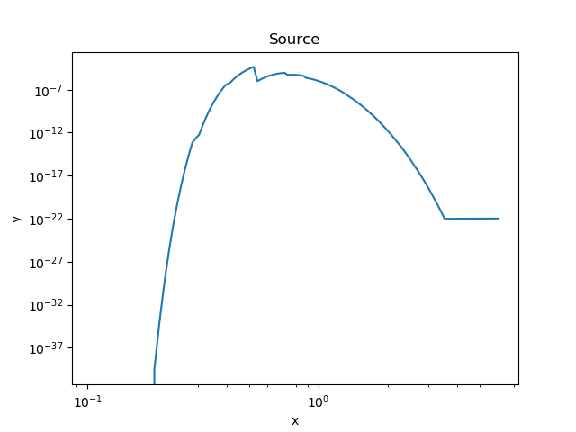

# Allow the XSPEC local models to be used in Sherpa

This is an experiment in providing support for the
[XSPEC local models](https://github.com/HEASARC/xspec_localmodels)
in
[Sherpa](https://cxc.harvard.edu/sherpa/).

At present the *only* supported model is `zkerrbb`, and
there has been essentially no testing to check this works
correctly (although development of this package did find
a bug in the FORTRAN code of the model).

At the moment I have only got this working with the conda
release of CIAO 4.12, using Linux/Python 3.7. For some reason
it doesn't seem to work with the ciao-install version of CIAO 4.12
(a link error). It could be adapted to work with CIAO 4.11, but
this would require changing the include files in the `xspec/`
directory and the versions of the XSPEC libraries that are linked
to (`hdsp`, `CCfits`) in `setup.py`.

## Legal Terms

This code is released into the public domain, using the
[CC0 1.0 Universal (CC0 1.0) Public Domain Dedication](https://creativecommons.org/publicdomain/zero/1.0/), which can also be found in the
LICENSE file in the distribution.

## Author and Support

This was written by Doug Burke - dburke.gw@gmail.com - and
support is on a best-effort basis. It is *not* an official
product of my employer.

# Installation

Start up CIAO - preferably CIAO 4.12 - and then try

```
% git clone https://github.com/DougBurke/xspeclmodels
% cd xspeclmodels
% python setup.py build
```

Hopefully there'll be no error message here.

You can change to the build directory, it will be called
`build/lib.<something-or-other-involving-linus-or-macos>',
to test out the module. I suggest the example session from the
"Use" section below.

After testing - or before, if you feel adventurous - you will
want to install the module (or you can just copy around the files
to your current working directory). Note that you will need write
permission to your Python environment, which likely means you installed
CIAO yourself (if installed with `ciao-install`), or you
are trying out the conda installation of CIAO. This means
there is a possibility that it could mess up your CIAO installation
(unlikely, but I mention it just in case). You do keep the
download files for CIAO (when using `ciao-install`), don't
you!

```
% python setup.py install
```

# Use

After installation, you should be able to start Sherpa and
import the `xspeclmodels.ui` module, which will add the
XSPEC local models to Sherpa:

```
% sherpa
-----------------------------------------------------
Welcome to Sherpa: CXC's Modeling and Fitting Package
-----------------------------------------------------
Sherpa 4.12.0

Python 3.7.5 (default, Oct 25 2019, 15:51:11)
Type 'copyright', 'credits' or 'license' for more information
IPython 7.10.1 -- An enhanced Interactive Python. Type '?' for help.

IPython profile: sherpa
Using matplotlib backend: Qt5Agg

sherpa In [1]: import xspeclmodels.ui
Adding XSPEC local model: xszkerrbb

sherpa In [2]: src = xsphabs.gal * xszkerrbb.mdk

sherpa In [3]: print(src)
(xsphabs.gal * xszkerrbb.mdl)
   Param        Type          Value          Min          Max      Units
   -----        ----          -----          ---          ---      -----
   gal.nH       thawed            1            0       100000 10^22 atoms / cm^2
   mdl.eta      frozen            0            0            1
   mdl.a        thawed          0.5        -0.99        0.999
   mdl.i        frozen           30            0           85     degree
   mdl.Mbh      frozen        1e+07            3        1e+10      M_sun
   mdl.Mdd      thawed            1        1e-05        10000       M0yr
   mdl.z        frozen         0.01            0           10
   mdl.fcol     frozen            2         -100          100
   mdl.rflag    thawed            1 -3.40282e+38  3.40282e+38
   mdl.lflag    thawed            1 -3.40282e+38  3.40282e+38
   mdl.norm     thawed            1            0        1e+24

sherpa In [4]: dataspace1d(0.1, 6, 0.01)

sherpa In [5]: set_source(src)

sherpa In [6]: plot_source(xlog=True, ylog=True)
```



For those that just want the model class, and do not use the
Sherpa "UI" layer, you can just `import xspeclmodels`.
